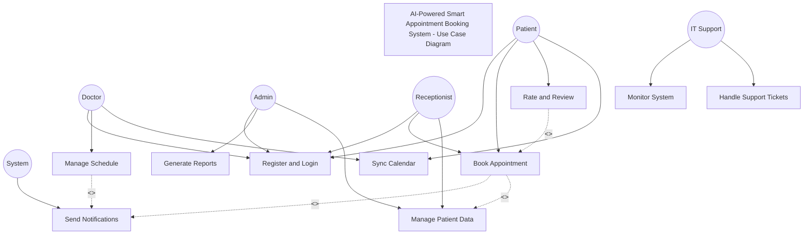

# Assignment 5: Use Case Modeling and Test Case Development
## AI-Powered Smart Appointment Booking System

## 1. Use Case Diagrams (30 Marks)

### Use Case Diagram

### Key Actors and Their Roles

1. **Patient**
   - Primary user of the appointment booking system
   - Books and manages appointments
   - Provides feedback through ratings and reviews
   - Syncs appointments with personal calendar

2. **Doctor**
   - Healthcare provider managing their schedule
   - Sets availability and working hours
   - Views upcoming appointments
   - Manages calendar synchronization

3. **Admin**
   - System administrator with oversight capabilities
   - Generates and analyzes reports
   - Manages patient data and system configuration
   - Ensures system compliance and security

4. **Receptionist**
   - Front-desk staff assisting with appointments
   - Helps patients with booking process
   - Manages patient records
   - Handles basic system operations

5. **IT Support**
   - Technical team maintaining system health
   - Monitors system performance
   - Handles support tickets
   - Ensures system security and uptime

6. **System**
   - Automated actor handling notifications
   - Sends reminders and confirmations
   - Processes appointment requests
   - Maintains data integrity

### Relationships Between Actors and Use Cases

#### Direct Associations
- Actors are connected to use cases they directly interact with using solid lines
- Example: Patient → Book Appointment shows direct interaction

#### Include Relationships (<<include>>)
1. **Book Appointment → Send Notifications**
   - Every booking automatically triggers notifications
   - Ensures consistent communication flow

2. **Manage Schedule → Send Notifications**
   - Schedule changes trigger notifications to affected parties
   - Maintains synchronization between doctor and patient schedules

3. **Book Appointment → Manage Patient Data**
   - Booking process requires access to patient records
   - Ensures data consistency and accuracy

#### Extend Relationships (<<extend>>)
1. **Rate and Review → Book Appointment**
   - Optional feature available after appointment completion
   - Enhances service quality through feedback

### Addressing Stakeholder Concerns

1. **Patient Concerns**
   - Easy appointment booking addressed through dedicated "Book Appointment" use case
   - Reminder system implemented via "Send Notifications"
   - Calendar integration through "Sync Calendar" use case
   - Addresses pain points: long waiting times and lack of reminders

2. **Doctor Concerns**
   - Schedule management through "Manage Schedule" use case
   - Notification system reduces no-shows
   - Calendar sync improves time management
   - Addresses pain points: last-minute cancellations and overbooked schedules

3. **Receptionist Concerns**
   - Simplified booking management through shared access to booking system
   - Patient data management streamlined
   - Addresses pain points: tedious manual processes and scheduling errors

4. **Admin Concerns**
   - Comprehensive reporting through "Generate Reports"
   - Patient data management capabilities
   - Addresses pain points: lack of real-time insights

5. **IT Support Concerns**
   - System monitoring capabilities
   - Support ticket management
   - Addresses pain points: system maintenance and security

6. **Regulatory Compliance**
   - Secure patient data management
   - System monitoring for compliance
   - Addresses pain points: data privacy and security requirements

## 2. Use Case Specifications (30 Marks)

### 1. Book Appointment (UC2)
**Actor:** Patient, Receptionist
**Description:** Allows patients or receptionists to book medical appointments
**Preconditions:** 
- User is logged in
- Doctor availability is up to date

**Basic Flow:**
1. User selects "Book Appointment" option
2. System displays available doctors and time slots
3. User selects preferred doctor and time slot
4. System validates the selection
5. User confirms booking
6. System creates appointment and sends confirmation

**Alternative Flows:**
- A1: Selected time slot becomes unavailable
  1. System notifies user of unavailability
  2. Returns to step 2
- A2: Doctor cancels availability
  1. System notifies affected patients
  2. Offers rebooking options

**Postconditions:**
- Appointment is created
- Confirmation sent to patient
- Doctor's schedule updated

[Additional use cases continue as in use_case_specifications.md...]

## 3. Test Case Development (30 Marks)

### Functional Test Cases

| Test Case ID | Requirement ID | Description | Steps | Expected Result | Actual Result | Status |
|--------------|---------------|-------------|--------|-----------------|---------------|---------|
| TC001 | FR1 | User Registration | 1. Navigate to registration page 2. Enter valid details 3. Submit form 4. Verify email | - User account created - Verification email received - 2FA setup prompted | - | Pending |
| TC002 | FR2 | Appointment Booking | 1. Login as patient 2. Select "Book Appointment" 3. Choose doctor and time 4. Confirm booking | - Appointment created - Confirmation email sent - Doctor's schedule updated | - | Pending |

[Additional test cases continue as in test_cases.md...]

### Non-Functional Test Cases

#### Performance Test Scenario
**Objective:** Verify system performance under peak load
- **Setup:**
  - Generate 1000 virtual users
  - Each user performs common actions (booking, searching)
  - Monitor for 1 hour during peak time
- **Success Criteria:**
  - Average response time < 2 seconds
  - Zero system crashes
  - CPU usage < 80%
  - Memory usage < 90%

[Additional test scenarios continue as in test_cases.md...]

## 4. Documentation & Clarity (10 Marks)

### Reflection
[Content from reflection.md is included here...]

### Project Documentation Updates
- All artifacts have been added to the repository
- Documentation maintains consistency with Assignment 4
- Clear traceability between requirements, use cases, and test cases
- Comprehensive coverage of system functionality
