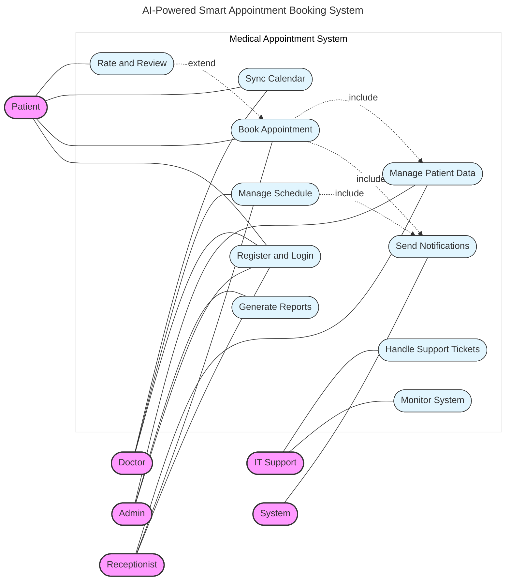

```mermaid
---
title: AI-Powered Smart Appointment Booking System
---
%%{init: {'theme': 'base', 'themeVariables': { 'primaryColor': '#fff', 'primaryBorderColor': '#333'}}}%%
graph LR
    %% Actors on the left
    Patient([Patient]):::actor
    Doctor([Doctor]):::actor
    Admin([Admin]):::actor
    Receptionist([Receptionist]):::actor
    ITSupport([IT Support]):::actor
    System([System]):::actor

    %% System boundary
    subgraph Medical Appointment System
        %% Core Use Cases
        UC1([Register and Login]):::usecase
        UC2([Book Appointment]):::usecase
        UC3([Manage Schedule]):::usecase
        UC4([Send Notifications]):::usecase
        UC5([Generate Reports]):::usecase
        UC6([Manage Patient Data]):::usecase
        UC7([Sync Calendar]):::usecase
        UC8([Rate and Review]):::usecase
        UC9([Monitor System]):::usecase
        UC10([Handle Support Tickets]):::usecase
    end

    %% Actor Associations
    Patient --- UC1 & UC2 & UC7 & UC8
    Doctor --- UC1 & UC3 & UC7
    Admin --- UC1 & UC5 & UC6
    Receptionist --- UC1 & UC2 & UC6
    ITSupport --- UC9 & UC10
    System --- UC4

    %% Include/Extend Relationships
    UC2 -. include .-> UC4
    UC3 -. include .-> UC4
    UC2 -. include .-> UC6
    UC8 -. extend .-> UC2

    %% Styling
    classDef actor fill:#f9f,stroke:#333,stroke-width:2px,rx:15px
    classDef usecase fill:#e1f5fe,stroke:#333,stroke-width:1px,rx:10px
    linkStyle default stroke:#333,stroke-width:1px
```
