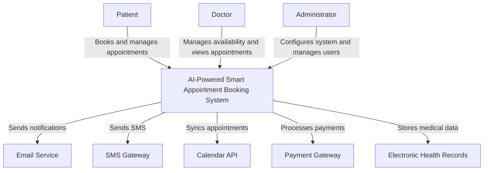
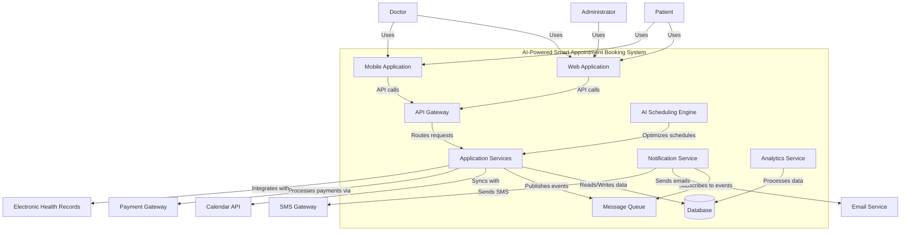
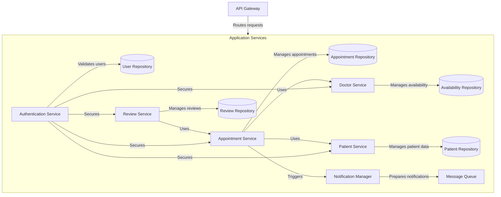

# Assignment 8: Object State Modeling and Activity Workflow Modeling

This repository contains state transition diagrams and activity diagrams for the AI-Powered Smart Appointment Booking System, continuing from the requirements (Assignment 4), use cases (Assignment 5), Agile planning (Assignment 6), and Kanban workflow (Assignment 7).

## Repository Structure

### State Transition Diagrams
- [Appointment State Diagram](./state_diagrams/appointment_state_diagram.md)
- [User Account State Diagram](./state_diagrams/user_account_state_diagram.md)
- [Doctor Availability State Diagram](./state_diagrams/doctor_availability_state_diagram.md)
- [Patient Record State Diagram](./state_diagrams/patient_record_state_diagram.md)
- [Notification State Diagram](./state_diagrams/notification_state_diagram.md)
- [Review State Diagram](./state_diagrams/review_state_diagram.md)
- [System Access State Diagram](./state_diagrams/system_access_state_diagram.md)

### Activity Diagrams
- [Appointment Booking Workflow](./activity_diagrams/appointment_booking_workflow.md)
- [Doctor Availability Management Workflow](./activity_diagrams/doctor_availability_workflow.md)
- [Appointment Reminder Workflow](./activity_diagrams/appointment_reminder_workflow.md)
- [Patient Registration Workflow](./activity_diagrams/patient_registration_workflow.md)
- [Appointment Rescheduling Workflow](./activity_diagrams/appointment_rescheduling_workflow.md)
- [Appointment Cancellation Workflow](./activity_diagrams/appointment_cancellation_workflow.md)
- [Appointment Review Workflow](./activity_diagrams/appointment_review_workflow.md)
- [System Monitoring Workflow](./activity_diagrams/system_monitoring_workflow.md)

### Explanations
- [State Diagram Explanations](./explanations/state_diagram_explanations.md)
- [Activity Diagram Explanations](./explanations/activity_diagram_explanations.md)
- [Integration with Prior Work](./explanations/integration_with_prior_work.md)
- [Reflection](./explanations/reflection.md)

## Project Overview

The AI-Powered Smart Appointment Booking System allows patients to schedule medical appointments online and enables healthcare providers to manage their availability efficiently. This repository focuses on modeling the dynamic behavior of the system using state transition diagrams (object state modeling) and activity diagrams (workflow modeling).

### Key Features of the System

- **Intelligent Appointment Scheduling**: The system uses AI to optimize appointment scheduling, considering doctor availability, patient preferences, and appointment types.
- **Multi-channel Notifications**: Automated reminders are sent via email, SMS, and app notifications based on patient preferences.
- **Doctor Availability Management**: Healthcare providers can set recurring schedules, block time slots, and manage vacation time.
- **Patient Self-service Portal**: Patients can book, reschedule, cancel appointments, and view their medical history.
- **Feedback and Quality Improvement**: Post-appointment reviews and ratings help improve service quality.
- **Secure Access Control**: Role-based permissions ensure appropriate access to sensitive information.
- **Waitlist Management**: Automatically offers cancelled slots to waitlisted patients.
- **Calendar Integration**: Synchronizes with popular calendar applications (Google, Apple, Outlook).
- **Performance Monitoring**: Continuous system monitoring ensures reliability and security.

### System Architecture

The system follows a modern microservices architecture with:
- Frontend user interfaces for patients, doctors, and administrative staff
- Backend API services for appointment management, notifications, and user management
- Secure database for storing patient records and appointment information
- Integration services for connecting with external systems (calendars, SMS gateways)
- Monitoring and analytics services for system performance and business intelligence

### Stakeholders

- **Patients**: Primary users who book and manage appointments
- **Doctors**: Healthcare providers who set availability and conduct appointments
- **Administrative Staff**: Receptionists and office managers who oversee scheduling
- **IT Support**: Technical staff who maintain the system
- **Healthcare Management**: Executives who analyze system data for business decisions

## Assignment Requirements Fulfilled

1. **Object State Modeling with State Transition Diagrams**
   - Created 7 state transition diagrams for critical objects in the system
   - Used UML standards with states, transitions, events, and guard conditions
   - Provided detailed explanations for each diagram

2. **Activity Workflow Modeling with Activity Diagrams**
   - Created 8 activity diagrams for complex workflows
   - Included start/end nodes, actions, decisions, parallel actions, and swimlanes
   - Provided explanations for each workflow

3. **Integration with Prior Work**
   - Mapped diagrams to functional requirements and user stories
   - Updated README with links to diagrams and explanations

4. **Reflection**
   - Discussed challenges in choosing granularity for states/actions
   - Analyzed alignment of diagrams with Agile user stories
   - Compared state diagrams vs. activity diagrams

## Deliverables

1. **State Transition Diagrams**:
   - 7 comprehensive UML state diagrams in Mermaid syntax
   - Located in the [state_diagrams](./state_diagrams/) directory
   - Each diagram includes states, transitions, events, and guard conditions

2. **Activity Diagrams**:
   - 8 detailed UML activity diagrams in Mermaid syntax
   - Located in the [activity_diagrams](./activity_diagrams/) directory
   - Each diagram includes start/end nodes, actions, decisions, parallel actions, and swimlanes

3. **Explanations**:
   - Markdown files linking diagrams to requirements
   - [State Diagram Explanations](./explanations/state_diagram_explanations.md)
   - [Activity Diagram Explanations](./explanations/activity_diagram_explanations.md)
   - [Integration with Prior Work](./explanations/integration_with_prior_work.md)

4. **Updated GitHub Repository**:
   - Complete repository with all diagrams and documentation
   - Well-organized directory structure
   - Comprehensive README with navigation links

5. **Reflection**:
   - Lessons learned documented in [reflection.md](./explanations/reflection.md)
   - Analysis of modeling challenges and solutions
   - Comparison of different modeling approaches

## Previous Assignments
- [Assignment 7: GitHub Project Templates and Kanban Board Implementation](https://github.com/ncayiyane/Assignment-7.git)
- [Assignment 6: Agile User Stories, Backlog, and Sprint Planning](https://github.com/ncayiyane/Assignment-5-.git)

## System Architecture & Technical Documentation

### System Requirements

#### Hardware Requirements
- **Server**: 
  - CPU: Minimum 4 cores, recommended 8+ cores
  - RAM: Minimum 8GB, recommended 16GB+
  - Storage: Minimum 100GB SSD
  - Network: 1Gbps Ethernet connection

#### Software Requirements
- **Backend**:
  - Node.js (v14+) or Java Spring Boot (v2.5+)
  - PostgreSQL (v12+) for primary database
  - Redis (v6+) for caching and session management
  - RabbitMQ for message queuing
  
- **Frontend**:
  - React.js (v17+) for web interface
  - React Native (v0.65+) for mobile applications
  - Redux for state management
  
- **DevOps**:
  - Docker and Docker Compose for containerization
  - Kubernetes for orchestration in production
  - CI/CD pipeline (GitHub Actions, Jenkins)
  - ELK Stack for logging and monitoring

### C4 Model Diagrams

#### Level 1: System Context Diagram


#### Level 2: Container Diagram


#### Level 3: Component Diagram (Example for Application Services)


### Installation and Setup

#### Prerequisites
1. Install Node.js (v14+) and npm (v6+)
2. Install Docker and Docker Compose
3. Install Git

#### Development Setup
1. Clone the repository:
   ```bash
   git clone https://github.com/yourusername/appointment-booking-system.git
   cd appointment-booking-system
   ```

2. Set up environment variables:
   ```bash
   cp .env.example .env
   # Edit .env with your configuration
   ```

3. Start the development environment:
   ```bash
   docker-compose up -d
   ```

4. Install frontend dependencies:
   ```bash
   cd frontend
   npm install
   npm start
   ```

5. Install backend dependencies:
   ```bash
   cd backend
   npm install
   npm run dev
   ```

#### Production Deployment
1. Build Docker images:
   ```bash
   docker-compose -f docker-compose.prod.yml build
   ```

2. Deploy to Kubernetes:
   ```bash
   kubectl apply -f k8s/
   ```

### API Documentation

The system exposes RESTful APIs for integration:

#### Authentication Endpoints
- `POST /api/auth/login` - Authenticate user
- `POST /api/auth/register` - Register new user
- `POST /api/auth/refresh` - Refresh authentication token

#### Appointment Endpoints
- `GET /api/appointments` - List appointments
- `POST /api/appointments` - Create appointment
- `PUT /api/appointments/:id` - Update appointment
- `DELETE /api/appointments/:id` - Cancel appointment

#### Doctor Availability Endpoints
- `GET /api/availability/:doctorId` - Get doctor availability
- `POST /api/availability` - Set availability
- `PUT /api/availability/:id` - Update availability
- `DELETE /api/availability/:id` - Remove availability

### Usage Examples

#### Booking an Appointment (Frontend)
```javascript
// Example React component for booking an appointment
const BookAppointment = () => {
  const [selectedDoctor, setSelectedDoctor] = useState(null);
  const [selectedDate, setSelectedDate] = useState(null);
  const [selectedTime, setSelectedTime] = useState(null);
  
  const handleBooking = async () => {
    try {
      const response = await api.post('/appointments', {
        doctorId: selectedDoctor.id,
        date: selectedDate,
        time: selectedTime,
        reason: 'Regular checkup'
      });
      
      if (response.status === 201) {
        alert('Appointment booked successfully!');
      }
    } catch (error) {
      console.error('Error booking appointment:', error);
    }
  };
  
  return (
    <div>
      {/* Doctor selection, date picker, time selection UI */}
      <button onClick={handleBooking}>Book Appointment</button>
    </div>
  );
};
```

#### Setting Doctor Availability (Backend)
```javascript
// Example Express route for setting doctor availability
router.post('/availability', authenticate, async (req, res) => {
  try {
    // Ensure user is a doctor
    if (req.user.role !== 'doctor') {
      return res.status(403).json({ message: 'Not authorized' });
    }
    
    const { weekday, startTime, endTime, recurring } = req.body;
    
    // Validate input
    if (!weekday || !startTime || !endTime) {
      return res.status(400).json({ message: 'Missing required fields' });
    }
    
    // Create availability slots
    const availability = await Availability.create({
      doctorId: req.user.id,
      weekday,
      startTime,
      endTime,
      recurring: recurring || false
    });
    
    return res.status(201).json(availability);
  } catch (error) {
    console.error('Error setting availability:', error);
    return res.status(500).json({ message: 'Server error' });
  }
});
```

### Monitoring and Maintenance

The system includes comprehensive monitoring and maintenance capabilities:

1. **Health Checks**: Endpoints for monitoring service health
   - `GET /health` - Overall system health
   - `GET /health/db` - Database connection status
   - `GET /health/services` - External service status

2. **Logging**: Structured logging with ELK stack
   - Application logs
   - Access logs
   - Error logs
   - Performance metrics

3. **Backup and Recovery**:
   - Daily automated database backups
   - Point-in-time recovery capability
   - Disaster recovery procedures documented in `/docs/disaster-recovery.md`

4. **Performance Tuning**:
   - Database query optimization
   - Caching strategies
   - Load balancing configuration
