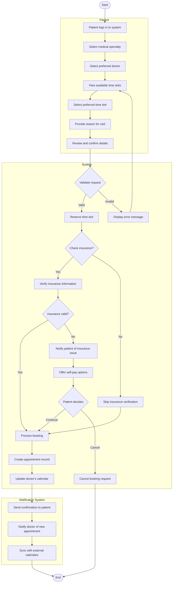

# Appointment Booking Workflow

## Activity Description

This activity diagram illustrates the complete workflow for booking an appointment in the AI-Powered Smart Appointment Booking System, from the patient's initial login to the final confirmation and calendar synchronization.

### Start/End Nodes
- **Start**: Patient initiates the appointment booking process
- **End**: Appointment is confirmed and calendars are updated, or booking is canceled

### Actions
1. **Patient logs in to system**: Patient authenticates with their credentials
2. **Select medical specialty**: Patient chooses the type of medical service needed
3. **Select preferred doctor**: Patient chooses from available doctors in the specialty
4. **View available time slots**: System displays available appointment times
5. **Select preferred time slot**: Patient chooses a specific date and time
6. **Provide reason for visit**: Patient enters information about their medical concern
7. **Review and confirm details**: Patient verifies all booking information
8. **Reserve time slot**: System temporarily holds the selected time slot
9. **Verify insurance information**: System validates patient's insurance coverage
10. **Process booking**: System finalizes the appointment booking
11. **Create appointment record**: System generates an appointment record in the database
12. **Update doctor's calendar**: Doctor's schedule is updated with the new appointment
13. **Send confirmation to patient**: System sends booking confirmation via email/SMS
14. **Notify doctor of new appointment**: Doctor receives notification about the booking
15. **Sync with external calendars**: Appointment is synchronized with external calendar systems

### Decisions
1. **Validate request**: Checks if all required information is provided and valid
2. **Check insurance**: Determines if insurance verification is needed
3. **Insurance valid**: Verifies if the patient's insurance is valid for the appointment
4. **Patient decides**: Patient chooses whether to continue with self-pay or cancel

### Parallel Actions
- The notification system handles multiple notifications simultaneously:
  - Sending confirmation to the patient
  - Notifying the doctor
  - Syncing with external calendars

### Swimlanes
- **Patient**: Actions performed by the patient
- **System**: Actions performed by the booking system
- **Notification System**: Actions related to notifications and external integrations
