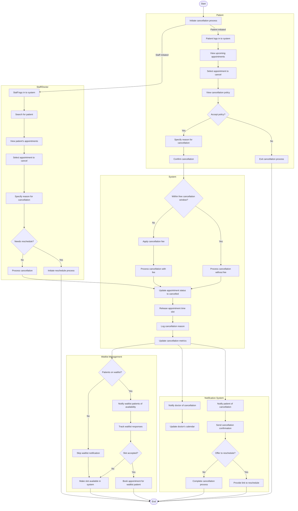

# Appointment Cancellation Workflow

## Activity Description

This activity diagram illustrates the workflow for cancelling an appointment in the AI-Powered Smart Appointment Booking System, including different processes depending on whether the cancellation is initiated by the patient or by staff/doctor.

### Start/End Nodes
- **Start**: Cancellation process is initiated
- **End**: Appointment is successfully cancelled or process is abandoned

### Actions
1. **Initiate cancellation process**: Process begins either by patient or staff
2. **Patient/Staff logs in**: User authenticates with the system
3. **View/Search appointments**: User locates the appointment to cancel
4. **Select appointment**: User identifies specific appointment to cancel
5. **View cancellation policy**: System displays rules and potential fees
6. **Specify reason for cancellation**: User provides justification
7. **Confirm cancellation**: User verifies the cancellation request
8. **Process cancellation**: System handles the appointment cancellation
9. **Update appointment status**: System marks appointment as cancelled
10. **Release time slot**: System makes the time slot available again
11. **Log cancellation reason**: System records why appointment was cancelled
12. **Update cancellation metrics**: System updates analytics data
13. **Notify patient/doctor**: System informs all parties of the cancellation
14. **Check waitlist**: System checks if other patients are waiting for this slot

### Decisions
1. **Accept policy?**: Patient decides whether to proceed with cancellation
2. **Needs reschedule?**: Staff determines if appointment should be rescheduled
3. **Within free cancellation window?**: System determines if cancellation fee applies
4. **Offer to reschedule?**: System decides whether to offer rescheduling options
5. **Patients on waitlist?**: System checks if waitlist notification is needed
6. **Slot accepted?**: System checks if waitlist patient accepts the slot

### Parallel Actions
- The notification system handles multiple notifications simultaneously:
  - Notifying the patient
  - Notifying the doctor
  - Updating calendars
- The waitlist management system operates in parallel:
  - Notifying waitlist patients
  - Tracking responses
  - Booking new appointments

### Swimlanes
- **Patient**: Actions performed by the patient when cancelling
- **Staff/Doctor**: Actions performed by staff when cancelling
- **System**: Core system actions for processing the cancellation
- **Notification System**: Actions related to notifications and confirmations
- **Waitlist Management**: Actions related to offering the slot to waitlisted patients
