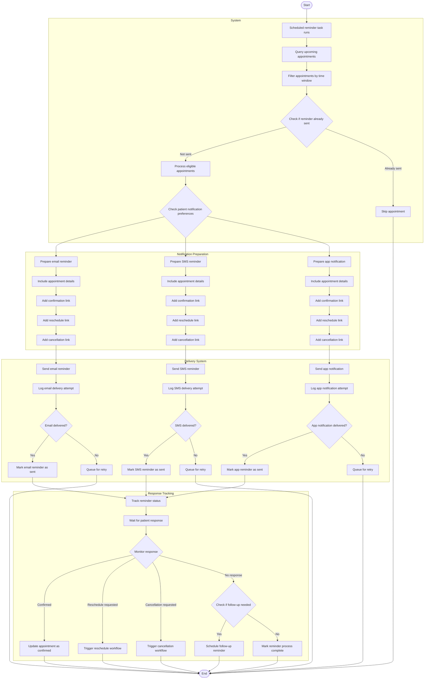

# Appointment Reminder Workflow

## Activity Description

This activity diagram illustrates the automated workflow for sending appointment reminders to patients in the AI-Powered Smart Appointment Booking System, including delivery through multiple channels and tracking patient responses.

### Start/End Nodes
- **Start**: Scheduled reminder task initiates
- **End**: Reminder process completes with appropriate status updates

### Actions
1. **Scheduled reminder task runs**: System automatically triggers the reminder process at predetermined intervals
2. **Query upcoming appointments**: System retrieves all appointments from the database
3. **Filter appointments by time window**: System identifies appointments within the reminder timeframe (e.g., 24 hours before appointment)
4. **Process eligible appointments**: System prepares to send reminders for appointments that haven't received them yet
5. **Prepare email/SMS/app notification**: System generates reminder content for different channels
6. **Include appointment details**: System adds date, time, doctor name, and location to the reminder
7. **Add confirmation/reschedule/cancellation links**: System includes action links for patient response
8. **Send reminders**: System delivers notifications through selected channels
9. **Log delivery attempts**: System records whether notifications were successfully delivered
10. **Mark reminders as sent**: System updates the database to prevent duplicate reminders
11. **Track reminder status**: System monitors which reminders have been sent through which channels
12. **Wait for patient response**: System awaits patient interaction with the reminder
13. **Update appointment status**: System records patient confirmation
14. **Schedule follow-up reminder**: System sets up additional reminder if no response is received

### Decisions
1. **Check if reminder already sent**: Prevents duplicate reminders
2. **Check patient notification preferences**: Determines which channels to use for each patient
3. **Email/SMS/App notification delivered?**: Verifies successful delivery
4. **Monitor response**: Tracks different possible patient actions
5. **Check if follow-up needed**: Determines if additional reminder is required

### Parallel Actions
- The notification preparation system handles multiple formats simultaneously:
  - Email reminder preparation
  - SMS reminder preparation
  - App notification preparation
- The delivery system sends reminders through multiple channels in parallel

### Swimlanes
- **System**: Core system actions for identifying appointments needing reminders
- **Notification Preparation**: Actions related to creating reminder content
- **Delivery System**: Actions related to sending reminders through different channels
- **Response Tracking**: Actions related to monitoring and processing patient responses
