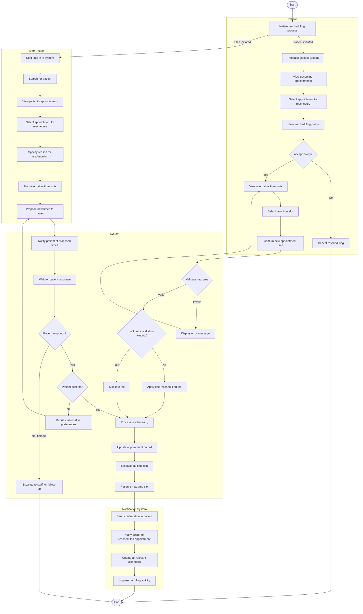

# Appointment Rescheduling Workflow

## Activity Description

This activity diagram illustrates the workflow for rescheduling an appointment in the AI-Powered Smart Appointment Booking System, whether initiated by the patient or by staff/doctor.

### Start/End Nodes
- **Start**: Rescheduling process is initiated
- **End**: Appointment is successfully rescheduled or process is abandoned

### Actions
1. **Initiate rescheduling process**: Process begins either by patient or staff
2. **Patient/Staff logs in**: User authenticates with the system
3. **View/Search appointments**: User locates the appointment to reschedule
4. **Select appointment**: User identifies specific appointment to change
5. **View rescheduling policy**: System displays rules and potential fees
6. **View alternative time slots**: System shows available alternative times
7. **Select new time slot**: User chooses preferred new time
8. **Confirm new appointment time**: User verifies the selection
9. **Specify reason for rescheduling**: Staff provides justification
10. **Propose new times to patient**: Staff suggests alternatives
11. **Process rescheduling**: System handles the appointment change
12. **Update appointment record**: System modifies the appointment data
13. **Release old time slot**: System makes previous time available
14. **Reserve new time slot**: System secures the new appointment time
15. **Send confirmation**: System notifies all parties of the change

### Decisions
1. **Accept policy?**: Patient decides whether to proceed with rescheduling
2. **Validate new time**: System checks if selected time is available
3. **Within cancellation window?**: System determines if late fees apply
4. **Patient responds?**: Checks if patient has responded to proposed times
5. **Patient accepts?**: Determines if patient agrees to suggested times

### Parallel Actions
- The notification system handles multiple updates simultaneously:
  - Sending confirmation to the patient
  - Notifying the doctor
  - Updating all relevant calendars
  - Logging the activity

### Swimlanes
- **Patient**: Actions performed by the patient when initiating rescheduling
- **Staff/Doctor**: Actions performed by staff when initiating rescheduling
- **System**: Core system actions for processing the rescheduling
- **Notification System**: Actions related to notifications and calendar updates
