# Appointment Review Workflow

```mermaid
flowchart TD
    Start([Start]) --> AppointmentCompleted[Appointment marked as completed]
    
    subgraph System [System]
        AppointmentCompleted --> WaitPeriod[Wait 24 hours after appointment]
        WaitPeriod --> GenerateReviewRequest[Generate review request]
        GenerateReviewRequest --> SendReviewPrompt[Send review prompt to patient]
        SendReviewPrompt --> TrackPromptDelivery{Prompt delivered?}
        
        TrackPromptDelivery -->|No| RetryDelivery[Retry delivery]
        RetryDelivery --> MaxRetries{Max retries reached?}
        MaxRetries -->|No| SendReviewPrompt
        MaxRetries -->|Yes| LogFailedPrompt[Log failed prompt delivery]
        
        TrackPromptDelivery -->|Yes| WaitForResponse[Wait for patient response]
        WaitForResponse --> MonitorResponseTime{Response received?}
        
        MonitorResponseTime -->|No, after 7 days| MarkNoReview[Mark appointment as no review]
        MonitorResponseTime -->|Yes| ProcessReviewSubmission[Process review submission]
    end
    
    subgraph Patient [Patient]
        ProcessReviewSubmission --> PatientOpensPrompt[Patient opens review prompt]
        PatientOpensPrompt --> ViewReviewForm[View review form]
        ViewReviewForm --> DecideToReview{Decide to review?}
        
        DecideToReview -->|No| DeclineFeedback[Decline to provide feedback]
        DecideToReview -->|Yes| ProvideStarRating[Provide star rating]
        
        ProvideStarRating --> RatingOnly{Provide text feedback?}
        RatingOnly -->|No| SubmitRatingOnly[Submit rating only]
        RatingOnly -->|Yes| ProvideTextFeedback[Provide text feedback]
        
        ProvideTextFeedback --> ReviewAttachment{Add attachments?}
        ReviewAttachment -->|No| SkipAttachment[Skip attachment]
        ReviewAttachment -->|Yes| UploadAttachment[Upload photos or documents]
        
        UploadAttachment --> FinalizeReview[Finalize review]
        SkipAttachment --> FinalizeReview
        SubmitRatingOnly --> FinalizeReview
        
        FinalizeReview --> SubmitReview[Submit review]
    end
    
    subgraph ContentModeration [Content Moderation]
        SubmitReview --> AutomaticContentCheck[Automatic content screening]
        AutomaticContentCheck --> ContentAppropriate{Content appropriate?}
        
        ContentAppropriate -->|Yes| PublishReview[Publish review]
        ContentAppropriate -->|No| FlagForModeration[Flag for human moderation]
        
        FlagForModeration --> ModeratorReview[Moderator reviews content]
        ModeratorReview --> ModeratorDecision{Moderator decision}
        
        ModeratorDecision -->|Approve| PublishReview
        ModeratorDecision -->|Reject| RejectReview[Reject review]
        ModeratorDecision -->|Request changes| NotifyPatientChanges[Notify patient of required changes]
        
        NotifyPatientChanges --> PatientEditsReview[Patient edits review]
        PatientEditsReview --> SubmitReview
    end
    
    subgraph ReviewManagement [Review Management]
        PublishReview --> UpdateDoctorRating[Update doctor's overall rating]
        UpdateDoctorRating --> NotifyDoctor[Notify doctor of new review]
        
        NotifyDoctor --> DoctorViewsReview[Doctor views review]
        DoctorViewsReview --> DoctorResponse{Doctor responds?}
        
        DoctorResponse -->|Yes| DoctorWritesResponse[Doctor writes response]
        DoctorResponse -->|No| SkipResponse[Skip response]
        
        DoctorWritesResponse --> PublishResponse[Publish doctor's response]
        PublishResponse --> LinkResponseToReview[Link response to review]
        
        LinkResponseToReview --> ArchiveReviewThread[Archive review thread]
        SkipResponse --> ArchiveReviewThread
    end
    
    DeclineFeedback --> End([End])
    LogFailedPrompt --> End
    MarkNoReview --> End
    RejectReview --> End
    ArchiveReviewThread --> End
```

## Activity Description

This activity diagram illustrates the workflow for collecting, moderating, and publishing patient reviews after appointments in the AI-Powered Smart Appointment Booking System.

### Start/End Nodes
- **Start**: Process begins when an appointment is marked as completed
- **End**: Review is published, rejected, or patient declines to provide feedback

### Actions
1. **Appointment marked as completed**: Doctor finalizes the appointment record
2. **Wait 24 hours after appointment**: System delays review request
3. **Generate review request**: System creates personalized review prompt
4. **Send review prompt to patient**: System delivers notification via preferred channel
5. **Patient opens review prompt**: Patient accesses the review interface
6. **Provide star rating**: Patient selects numerical rating (typically 1-5 stars)
7. **Provide text feedback**: Patient writes comments about their experience
8. **Upload attachments**: Patient optionally adds photos or documents
9. **Submit review**: Patient finalizes and submits their feedback
10. **Automatic content screening**: System checks for inappropriate content
11. **Moderator reviews content**: Human moderator evaluates flagged content
12. **Publish review**: System makes review visible in the system
13. **Update doctor's overall rating**: System recalculates aggregate rating
14. **Doctor writes response**: Doctor can provide a reply to the review
15. **Archive review thread**: System finalizes the review process

### Decisions
1. **Prompt delivered?**: Checks if review request reached the patient
2. **Max retries reached?**: Determines if system should continue delivery attempts
3. **Response received?**: Checks if patient submitted a review within timeframe
4. **Decide to review?**: Patient chooses whether to provide feedback
5. **Provide text feedback?**: Patient decides whether to add comments
6. **Add attachments?**: Patient decides whether to include media
7. **Content appropriate?**: System evaluates content against guidelines
8. **Moderator decision**: Human moderator determines if review meets standards
9. **Doctor responds?**: Doctor decides whether to reply to the review

### Parallel Actions
- The content moderation system operates independently:
  - Automatic screening
  - Human moderation when needed
  - Patient notification for required changes
- The review management system handles multiple processes:
  - Updating doctor ratings
  - Notifying doctors
  - Publishing responses

### Swimlanes
- **System**: Core system actions for initiating and tracking the review process
- **Patient**: Actions performed by the patient when providing feedback
- **Content Moderation**: Actions related to ensuring appropriate content
- **Review Management**: Actions related to publishing and responding to reviews
