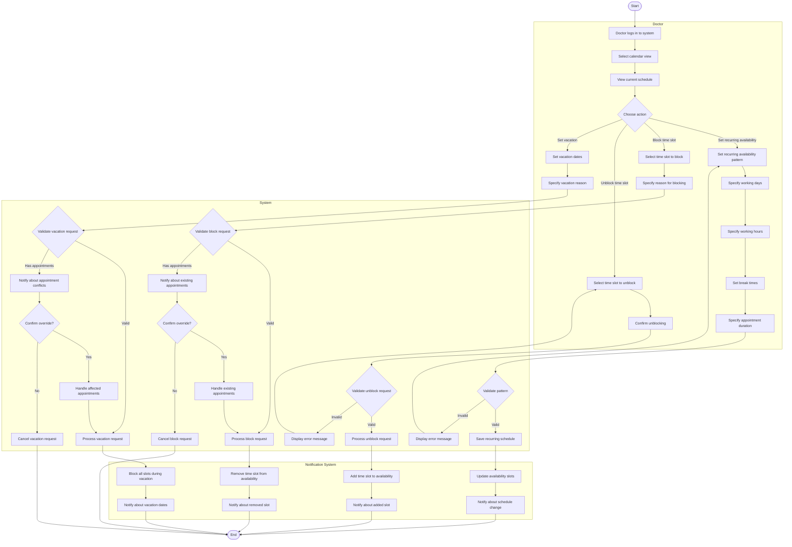

# Doctor Availability Management Workflow

## Activity Description

This activity diagram illustrates the workflow for doctors to manage their availability in the AI-Powered Smart Appointment Booking System, including setting regular hours, blocking time slots, and managing vacation time.

### Start/End Nodes
- **Start**: Doctor initiates the availability management process
- **End**: Availability settings are updated in the system

### Actions
1. **Doctor logs in to system**: Doctor authenticates with their credentials
2. **Select calendar view**: Doctor chooses daily, weekly, or monthly view
3. **View current schedule**: System displays current availability and appointments
4. **Set recurring availability pattern**: Doctor establishes regular working hours
5. **Specify working days**: Doctor selects which days of the week they work
6. **Specify working hours**: Doctor sets start and end times for each working day
7. **Set break times**: Doctor blocks out regular breaks (lunch, meetings, etc.)
8. **Specify appointment duration**: Doctor sets standard appointment length
9. **Select time slot to block**: Doctor chooses specific time to make unavailable
10. **Specify reason for blocking**: Doctor provides reason for unavailability
11. **Select time slot to unblock**: Doctor chooses previously blocked time to restore
12. **Set vacation dates**: Doctor selects dates for extended absence
13. **Update availability slots**: System generates individual appointment slots
14. **Remove time slot from availability**: System marks specific time as unavailable
15. **Add time slot to availability**: System makes previously blocked time available
16. **Block vacation dates**: System marks all affected dates as unavailable

### Decisions
1. **Choose action**: Doctor selects which availability management task to perform
2. **Validate pattern**: System checks if recurring schedule pattern is valid
3. **Validate block request**: System verifies if time slot can be blocked
4. **Confirm override**: Doctor decides whether to reschedule existing appointments
5. **Validate unblock request**: System checks if time slot can be unblocked
6. **Validate vacation request**: System verifies if vacation can be scheduled
7. **Confirm vacation override**: Doctor decides how to handle appointments during vacation

### Parallel Actions
- The notification system processes multiple updates simultaneously:
  - Updating availability slots
  - Notifying affected patients if appointments need rescheduling
  - Updating the booking system's available slots

### Swimlanes
- **Doctor**: Actions performed by the doctor
- **System**: Actions performed by the availability management system
- **Notification System**: Actions related to notifications and calendar updates
