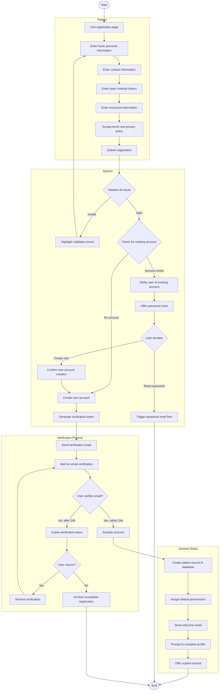

# Patient Registration Workflow

## Activity Description

This activity diagram illustrates the complete workflow for patient registration in the AI-Powered Smart Appointment Booking System, from initial form completion through verification to account activation.

### Start/End Nodes
- **Start**: Patient initiates the registration process
- **End**: Patient account is created and activated, or process is abandoned

### Actions
1. **Visit registration page**: Patient accesses the registration form
2. **Enter basic personal information**: Patient provides name, date of birth, gender, etc.
3. **Enter contact information**: Patient provides phone, email, address
4. **Enter basic medical history**: Patient provides allergies, conditions, medications
5. **Enter insurance information**: Patient provides insurance details if applicable
6. **Accept terms and privacy policy**: Patient agrees to system terms
7. **Submit registration**: Patient submits the completed form
8. **Validate all inputs**: System checks for required fields and format validity
9. **Highlight validation errors**: System shows which fields need correction
10. **Check for existing account**: System verifies if email is already registered
11. **Create user account**: System generates new user credentials
12. **Generate verification token**: System creates a unique verification code
13. **Send verification email**: System sends email with verification link
14. **Activate account**: System enables full account functionality
15. **Create patient record**: System stores comprehensive patient information
16. **Send welcome email**: System sends onboarding information

### Decisions
1. **Validate all inputs**: Checks if all required information is provided correctly
2. **Check for existing account**: Determines if user already has an account
3. **User decides**: User chooses between password reset or new account
4. **User verifies email**: Checks if verification was completed
5. **User returns**: Determines if user returns after expired verification

### Parallel Actions
- The verification process runs independently of the main system flow:
  - Sending verification email
  - Monitoring for verification response
  - Handling verification expiration

### Swimlanes
- **Patient**: Actions performed by the patient during registration
- **System**: Core system actions for processing registration
- **Verification Process**: Actions related to email verification
- **Account Setup**: Actions related to finalizing the account
