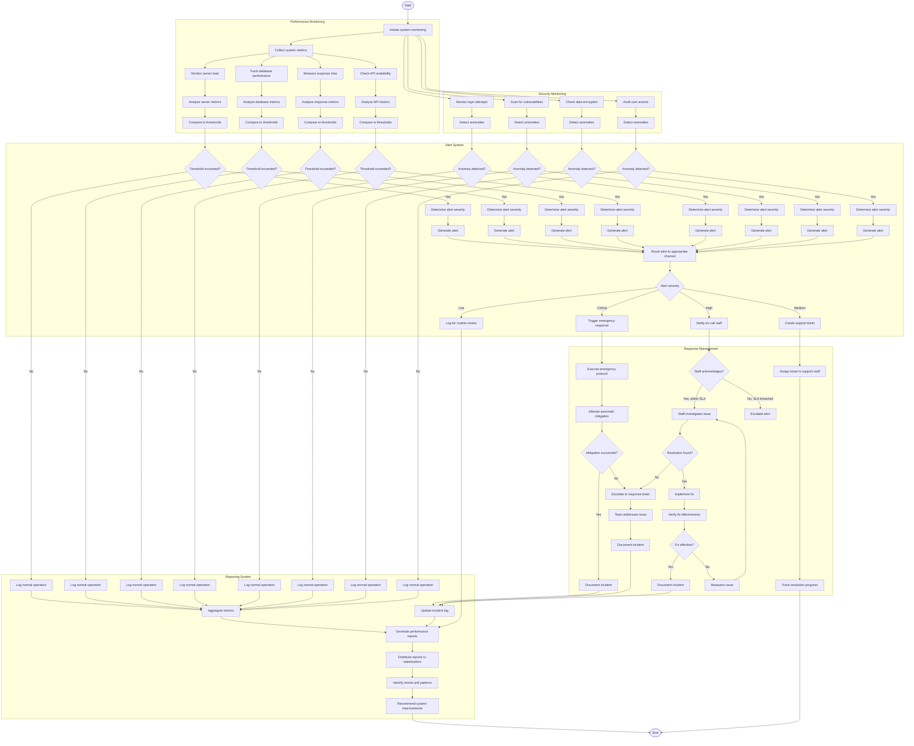

# System Monitoring Workflow

## Activity Description

This activity diagram illustrates the workflow for monitoring system performance, security, and responding to issues in the AI-Powered Smart Appointment Booking System.

### Start/End Nodes
- **Start**: System monitoring process initiates (typically runs continuously)
- **End**: Monitoring cycle completes with reports and recommendations

### Actions
1. **Collect system metrics**: Gather data on system performance
2. **Monitor server load**: Track CPU, memory, and network utilization
3. **Track database performance**: Monitor query times and database health
4. **Measure response time**: Track system responsiveness to user actions
5. **Check API availability**: Verify all system APIs are functioning
6. **Monitor login attempts**: Track authentication activity for security
7. **Scan for vulnerabilities**: Proactively check for security weaknesses
8. **Check data encryption**: Verify patient data remains properly encrypted
9. **Audit user actions**: Monitor system usage for suspicious activity
10. **Determine alert severity**: Classify issues by impact and urgency
11. **Generate alert**: Create notification for detected issues
12. **Execute emergency protocol**: Implement predefined response for critical issues
13. **Attempt automatic mitigation**: System tries to resolve issues automatically
14. **Document incident**: Record details of issues and resolutions
15. **Generate performance reports**: Create summaries of system health

### Decisions
1. **Threshold exceeded?**: Determines if metrics are outside acceptable ranges
2. **Anomaly detected?**: Identifies unusual patterns that may indicate problems
3. **Alert severity**: Categorizes issues by importance (Critical/High/Medium/Low)
4. **Mitigation successful?**: Checks if automatic fixes resolved the issue
5. **Staff acknowledges?**: Verifies if on-call staff responded within SLA
6. **Resolution found?**: Determines if staff identified a solution
7. **Fix effective?**: Verifies if implemented solution resolved the issue

### Parallel Actions
- Multiple monitoring systems operate simultaneously:
  - Performance monitoring tracks system health metrics
  - Security monitoring watches for threats and vulnerabilities
  - Alert system processes and routes notifications
  - Response management handles issue resolution
  - Reporting system documents system status and incidents

### Swimlanes
- **Performance Monitoring**: Actions related to tracking system health
- **Security Monitoring**: Actions related to protecting system and data
- **Alert System**: Actions for detecting and notifying about issues
- **Response Management**: Actions for addressing and resolving problems
- **Reporting System**: Actions for documenting system status and incidents
