# Class Diagram for AI-Powered Smart Appointment Booking System

## Mermaid.js Class Diagram

```mermaid
classDiagram
    class Patient {
        -patientId: String
        -name: String
        -email: String
        -phone: String
        -address: String
        -dateOfBirth: Date
        -medicalHistoryId: String
        +bookAppointment(doctorId, dateTime, type) Appointment
        +cancelAppointment(appointmentId) Boolean
        +rescheduleAppointment(appointmentId, newDateTime) Appointment
        +rateAppointment(appointmentId, score, comment) Rating
        +syncCalendar(calendarType) Boolean
        +viewAppointmentHistory() List~Appointment~
    }

    class Doctor {
        -doctorId: String
        -name: String
        -specialization: String
        -email: String
        -phone: String
        -department: String
        -licenseNumber: String
        +setAvailability(workingHours, blockedSlots) Boolean
        +viewAppointments(dateRange) List~Appointment~
        +updateSchedule(scheduleChanges) Boolean
        +accessPatientHistory(patientId) MedicalRecord
        +syncCalendar(calendarType) Boolean
    }

    class Appointment {
        -appointmentId: String
        -patientId: String
        -doctorId: String
        -dateTime: DateTime
        -duration: Integer
        -status: AppointmentStatus
        -type: AppointmentType
        -notes: String
        -createdAt: DateTime
        -updatedAt: DateTime
        +confirm() Boolean
        +cancel(reason) Boolean
        +reschedule(newDateTime) Boolean
        +sendReminder() Notification
        +generateNotification(type) Notification
    }

    class Schedule {
        -scheduleId: String
        -doctorId: String
        -workingHours: Map~DayOfWeek, TimeRange~
        -blockedSlots: List~TimeSlot~
        -availableSlots: List~TimeSlot~
        -lastUpdated: DateTime
        +addBlockedTime(timeSlot) Boolean
        +removeBlockedTime(timeSlot) Boolean
        +getAvailableSlots(date) List~TimeSlot~
        +checkAvailability(dateTime) Boolean
    }

    class TimeSlot {
        -slotId: String
        -startTime: DateTime
        -endTime: DateTime
        -status: SlotStatus
        +isAvailable() Boolean
        +book() Boolean
        +release() Boolean
        +getDuration() Integer
    }

    class Notification {
        -notificationId: String
        -recipientId: String
        -recipientType: RecipientType
        -type: NotificationType
        -content: String
        -timestamp: DateTime
        -status: NotificationStatus
        -appointmentId: String
        +send() Boolean
        +markAsRead() Boolean
        +markAsDelivered() Boolean
        +resend() Boolean
    }

    class Rating {
        -ratingId: String
        -patientId: String
        -appointmentId: String
        -doctorId: String
        -score: Integer
        -comment: String
        -timestamp: DateTime
        -isEdited: Boolean
        +submit() Boolean
        +edit(newScore, newComment) Boolean
        +delete() Boolean
    }

    class MedicalRecord {
        -recordId: String
        -patientId: String
        -diagnoses: List~Diagnosis~
        -medications: List~Medication~
        -allergies: List~String~
        -notes: String
        -lastUpdated: DateTime
        +addDiagnosis(diagnosis) Boolean
        +addMedication(medication) Boolean
        +updateAllergies(allergies) Boolean
        +getFullHistory() MedicalHistory
    }

    class Admin {
        -adminId: String
        -name: String
        -email: String
        -role: AdminRole
        -permissions: List~Permission~
        -lastLogin: DateTime
        +generateReports(reportType, dateRange) Report
        +manageUsers(action, userId) Boolean
        +configureSystem(settings) Boolean
        +monitorPerformance() SystemMetrics
    }

    class Report {
        -reportId: String
        -type: ReportType
        -dateRange: DateRange
        -generatedBy: String
        -createdAt: DateTime
        -data: Object
        +export(format) File
        +visualize() Chart
        +share(recipients) Boolean
    }

    class ContactInfo {
        -email: String
        -phone: String
        -address: String
        +validate() Boolean
        +update(newInfo) Boolean
    }

    %% Enumerations
    class AppointmentStatus {
        <<enumeration>>
        SCHEDULED
        CONFIRMED
        CANCELLED
        COMPLETED
        NO_SHOW
    }

    class AppointmentType {
        <<enumeration>>
        REGULAR
        FOLLOW_UP
        EMERGENCY
        CONSULTATION
        PROCEDURE
    }

    class NotificationType {
        <<enumeration>>
        CONFIRMATION
        REMINDER
        CANCELLATION
        RESCHEDULING
        GENERAL
    }

    class NotificationStatus {
        <<enumeration>>
        PENDING
        SENT
        DELIVERED
        READ
        FAILED
    }

    class SlotStatus {
        <<enumeration>>
        AVAILABLE
        BOOKED
        BLOCKED
    }

    class AdminRole {
        <<enumeration>>
        SYSTEM_ADMIN
        USER_MANAGER
        REPORT_ANALYST
        SUPPORT_STAFF
    }

    %% Relationships
    Patient "1" -- "0..*" Appointment : books
    Doctor "1" -- "0..*" Appointment : conducts
    Doctor "1" -- "1" Schedule : maintains
    Schedule "1" -- "0..*" TimeSlot : contains
    Appointment "1" -- "0..*" Notification : generates
    Patient "1" -- "0..*" Rating : submits
    Appointment "1" -- "0..1" Rating : receives
    Doctor "1" -- "0..*" Rating : rated in
    Patient "1" -- "1" MedicalRecord : has
    Doctor "1" -- "0..*" MedicalRecord : accesses
    Admin "1" -- "0..*" Report : generates
    Patient "1" -- "1" ContactInfo : has
    Doctor "1" -- "1" ContactInfo : has
```

## Key Design Decisions

1. **Entity Relationships**:
   - A patient can book multiple appointments, but each appointment belongs to exactly one patient and one doctor.
   - Doctors maintain their own schedules, which contain time slots that can be available, booked, or blocked.
   - Appointments generate notifications that can be sent to either patients or doctors.
   - Ratings are associated with both the appointment and the doctor being rated.

2. **Data Encapsulation**:
   - Contact information (email, phone, address) is encapsulated in a separate ContactInfo class to promote reuse.
   - Enumerations are used for status fields to ensure data integrity and type safety.
   - Medical records are separated from patient demographic information to support privacy and security requirements.

3. **Behavioral Design**:
   - Each class has methods that reflect its responsibilities in the system.
   - Appointment class serves as the central entity connecting patients and doctors.
   - Notification system is designed to be flexible, supporting different types of notifications and delivery statuses.

4. **System Administration**:
   - Admin class has different roles with varying levels of permissions.
   - Report generation is separated into its own class to support different report types and formats.
   - System configuration and monitoring are handled through the Admin class.

5. **Scalability Considerations**:
   - The design supports multiple doctors, patients, and appointments.
   - Time slots are managed efficiently to handle high-volume scheduling.
   - Notification system is designed to handle asynchronous message delivery.

This class diagram represents a comprehensive object-oriented design for the AI-Powered Smart Appointment Booking System, capturing all the key entities, their attributes, methods, and relationships as identified in the domain model.
